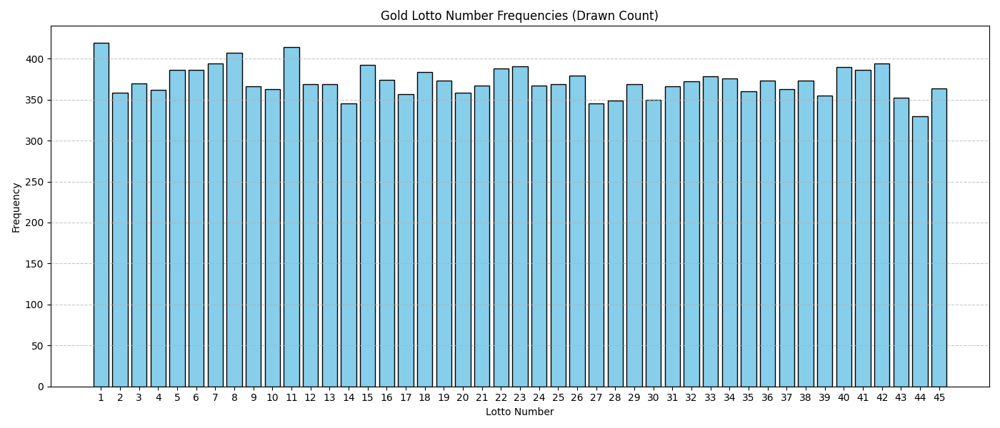
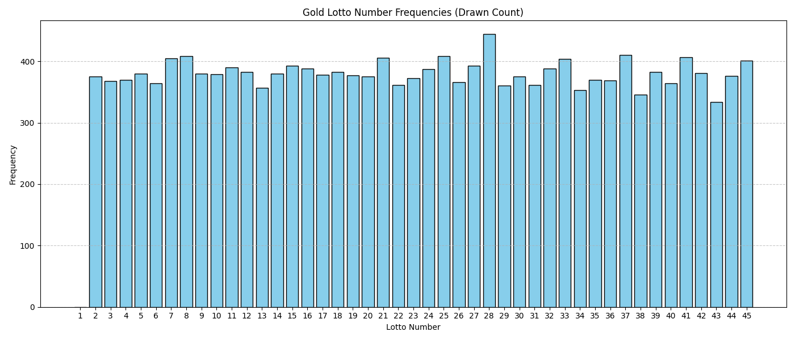
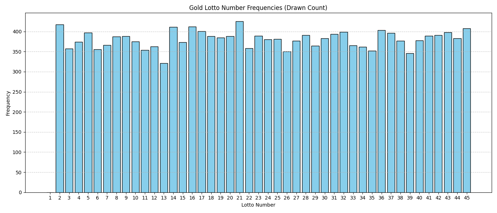
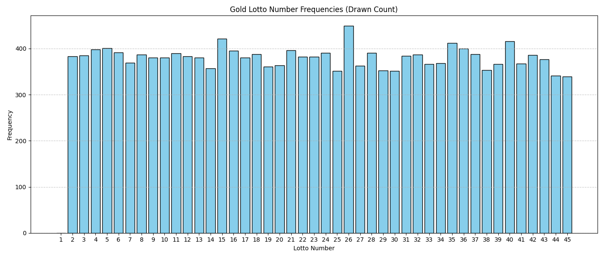

# Results

The distrubution of the real saturday lotto balls is nothing out of the ordinary.

Here's 4 graphs, one of them is the real distrubution but the other 3 are simulated samples:

It's impossible to tell which one is real and which ones are simulated (#1 is real, btw). With
the natural random variance of a uniform distrubution, it is likely that some balls
will appear significantly more often that others. 
